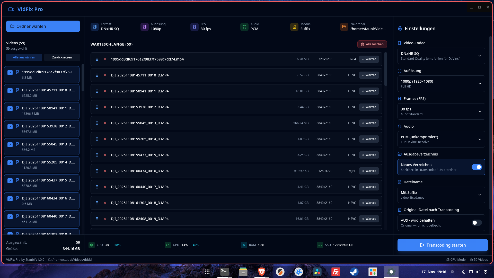

# VidFix Pro

**Moderne ffmpeg GUI für professionelle Video-Transcodierung**

VidFix Pro ist eine leistungsstarke Desktop-Anwendung zur Konvertierung von Videos in verschiedene professionelle Formate. Speziell optimiert für DaVinci Resolve, Premiere Pro und Final Cut - aber universell einsetzbar für alle Video-Workflows. Das Projekt besteht aus zwei Komponenten: einem interaktiven Bash-Script und einer modernen Electron Desktop-Anwendung mit Echtzeit-Monitoring.



## 🚀 Features

### Electron Desktop App (vidfix-app)

- **Moderne Benutzeroberfläche**: React 19 + TypeScript mit Glassmorphism-Design
- **Multi-Format Support**: MP4, MKV, MOV, AVI - alle gängigen Video-Formate
- **Intelligentes Batch-Processing**: Worker Pool mit 2-3 parallelen Jobs (optimiert für Multi-Core CPUs)
- **Multi-Progress UI**: Individueller Fortschrittsbalken für jedes Video in der Queue
- **Echtzeit-Monitoring**: Live CPU/GPU/RAM/Temperatur-Überwachung (AMD/Intel/NVIDIA optimiert)
- **Video-Vorschau**: ffprobe-basierte Metadaten-Anzeige mit Smart-Truncate
- **Preset-Manager**: Vordefinierte Profile (DaVinci Standard, 4K HQ, Archivierung, etc.)
- **Flexible Ausgabe**: Verschiedene Dateinamen-Optionen (Original, Suffix, Prefix)

### Bash Script (vidfix)

- **Interaktiver Modus**: Geführte Auswahl von Dateien und Einstellungen
- **Quick Mode**: Schnellstart mit `-go` Flag für Standardeinstellungen
- **Hardware-Beschleunigung**: VAAPI-Unterstützung für AMD/Intel GPUs
- **Fortschrittsanzeige**: Echtzeit-Progress mit Systemstatistiken
- **State Management**: Wiederaufnahme unterbrochener Transcodierungen

## ⚡ Performance-Optimierungen

### Multi-Threading & Parallelisierung
- **`-threads 0`**: Jedes Video nutzt automatisch **alle verfügbaren CPU-Kerne**
- **Worker Pool Pattern**: 2-3 Videos werden gleichzeitig verarbeitet (optimal für 8-16 Core CPUs)
- **Kontinuierliches Nachfüllen**: Sobald ein Video fertig ist, startet das nächste sofort
- **CPU-Auslastung**: Stabil bei 80-90% statt 100% (weniger Overhead)

### Multi-Progress UI
- **Individueller Fortschritt**: Jedes Video in der Queue zeigt seinen eigenen Progress-Balken
- **Echtzeit-Updates**: Prozent, Zeit (00:42/01:03), FPS pro Video
- **Parallele Anzeige**: Bei 3 Jobs → 3 Progress-Balken gleichzeitig sichtbar
- **Glassmorphism Design**: Moderne UI mit Gradient-Animationen

### Hardware-Monitoring
- **AMD GPU**: `amdgpu_top`, sysfs interfaces
- **Intel/NVIDIA**: `nvtop`, hwmon
- **CPU/RAM/Temp**: Live-Updates alle 2 Sekunden
- **System-Stats**: Überwachung während Batch-Processing

### Smart UI Features
- **Smart-Truncate**: Pfad-Verkürzung (`/home/user/...` → `~/.../videos`)
- **Pause/Resume**: Wirkt auf **alle** parallelen Prozesse gleichzeitig
- **Cancel**: Bricht alle laufenden Jobs ab (Map-basiertes Tracking)

## 📋 Unterstützte Codecs

### Video-Codecs

| Codec | Pixel Format | Verwendung | Performance |
|-------|--------------|------------|-------------|
| **DNxHR SQ** | yuv422p | DaVinci Resolve Standard (empfohlen) | Schnell ⚡ |
| **DNxHR HQ** | yuv422p | Höhere Qualität für professionelle Workflows | Mittel |
| **DNxHR HQX** | yuv422p10le | 10-bit für Color Grading | Langsam |
| **ProRes 422** | yuv422p10le | Final Cut Pro, macOS-optimiert | Mittel |
| **H.264** | nv12/yuv420p | Kompakt, GPU-beschleunigt (VAAPI) | Schnell ⚡ |
| **H.265 (HEVC)** | yuv420p | Beste Kompression für Archivierung | Langsam |
| **VP9** | yuv420p | Open-Source Alternative zu H.265 | Sehr langsam |
| **AV1** | yuv420p | Modernster Codec, beste Kompression | Extrem langsam |

### Audio-Codecs

| Codec | Qualität | Dateigröße | Verwendung |
|-------|----------|------------|------------|
| **PCM 16-bit** | Verlustfrei | Groß | DaVinci Resolve (empfohlen) |
| **FLAC** | Verlustfrei | Mittel | Archivierung mit Kompression |
| **AAC** | Hoch | Klein | Universell, beste Kompression |
| **MP3** | Mittel | Klein | Kompatibilität |
| **Opus** | Hoch | Sehr klein | Modern, effizient |
| **Vorbis** | Mittel | Klein | Open-Source Alternative |
| **Original** | - | - | Audio-Stream unverändert kopieren |

## 🎯 Anwendungsfälle

### Video-Editing & Post-Production
- **DaVinci Resolve**: DNxHR/ProRes für professionelle Color Grading
- **Adobe Premiere Pro**: ProRes/DNxHR für optimalen Workflow
- **Final Cut Pro**: ProRes 422 (macOS-optimiert)
- **Avid Media Composer**: DNxHR native Support

### Action-Cams & Consumer-Hardware
- **DJI Action 5 Pro / 4 / 3**: Kompatibilitätsfix für Resolve
- **GoPro Hero 12/11/10**: H.265 → DNxHR Konvertierung
- **Insta360**: 360°-Videos für Editing vorbereiten
- **Smartphones**: HEVC → Editing-freundliche Formate

### Archivierung & Backup
- **Langzeit-Archiv**: H.265/AV1 für maximale Kompression
- **Backup-Konvertierung**: Große Video-Sammlungen komprimieren
- **Format-Migration**: Alte Codecs in moderne Formate überführen

### Batch-Processing & Automatisierung
- **Hunderte Videos**: Worker Pool mit 2-3 parallelen Jobs
- **Kontinuierlicher Workflow**: Sobald ein Video fertig, startet das nächste
- **System-Monitoring**: CPU/GPU-Auslastung im Blick behalten

## 🛠️ Installation

### Voraussetzungen

```bash
# Arch Linux / Manjaro
sudo pacman -S ffmpeg nodejs npm

# Optional: GPU-Monitoring-Tools
sudo pacman -S nvtop amdgpu_top
```

### Electron App installieren

```bash
cd vidfix-app

# Dependencies installieren
npm install

# Development-Modus starten
npm run dev

# Production Build erstellen
npm run build
```

### Bash Script verwenden

```bash
# Ausführbar machen
chmod +x vidfix

# Interaktiver Modus
./vidfix

# Quick Mode (Standard: DNxHR SQ, 1080p, PCM)
./vidfix -go
```

## 📖 Verwendung

### Electron App

1. **Ordner wählen**: Videos-Verzeichnis auswählen
2. **Videos auswählen**: Checkbox-basierte Mehrfachauswahl
3. **Einstellungen**: Codec, Auflösung, FPS, Audio konfigurieren
4. **Transcoding starten**: Progress-Bar zeigt Fortschritt und System-Stats
5. **Fertig**: Videos werden im gewählten Ausgabeformat gespeichert

### Bash Script - Quick Mode

```bash
# Standard-Einstellungen (DNxHR SQ, 1080p, PCM)
./vidfix -go

# Navigiert automatisch zum Videos-Verzeichnis
# Zeigt alle .mp4/.MP4 Dateien
# Startet Transcoding mit Fortschrittsanzeige
```

## 🏗️ Architektur

### Electron App (Three-Process Architecture)

```
┌─────────────────────────────────────────────────────────┐
│  Main Process (electron/main.ts)                        │
│  - IPC Handlers                                         │
│  - File System Operations                               │
│  - vidfix Script Spawning                               │
│  - System Monitoring                                     │
└─────────────────┬───────────────────────────────────────┘
                  │
                  ▼
┌─────────────────────────────────────────────────────────┐
│  Preload Script (electron/preload.ts)                   │
│  - Context Bridge                                       │
│  - Type-safe IPC Communication                          │
└─────────────────┬───────────────────────────────────────┘
                  │
                  ▼
┌─────────────────────────────────────────────────────────┐
│  Renderer Process (src/)                                │
│  - React 19 Components                                  │
│  - Tailwind CSS Styling                                 │
│  - State Management (useState)                          │
└─────────────────────────────────────────────────────────┘
```

### Bash Script Workflow

```
Konfiguration → Dateiauswahl → Codec-Auswahl → Verarbeitung → Validierung
                      ↓              ↓               ↓
                  Bookmarks    DNxHR/ProRes    Parallel/Sequentiell
                  Browser      H.264/Custom     Progress Bar
```

## 🔧 Technologie-Stack

### Electron App

- **Frontend**: React 19, TypeScript
- **Styling**: Tailwind CSS, PostCSS
- **Build**: electron-vite, Vite
- **Icons**: Lucide React
- **Packaging**: electron-builder

### Bash Script

- **Shell**: Bash 4.0+
- **Video Processing**: ffmpeg, ffprobe
- **Monitoring**: amdgpu_top, nvtop, sysfs
- **UI**: ANSI colors, progress bars

## 📊 System-Anforderungen

- **OS**: Linux (getestet auf Arch Linux / Manjaro)
- **CPU**: Multi-Core empfohlen (Parallel-Processing)
- **GPU**: Optional (AMD/Intel mit VAAPI für Hardware-Beschleunigung)
- **RAM**: Mind. 8 GB (abhängig von Video-Auflösung)
- **Speicher**: 2-3x der Original-Video-Größe für DNxHR/ProRes

## 🐛 Bekannte Besonderheiten

- **Frame-based Duration**: Manche Action-Cams (z.B. DJI, GoPro) nutzen frame-basierte statt zeitbasierte Duration-Metadaten - wird automatisch erkannt und mit Fallback-Berechnung behandelt
- **VAAPI Pixel Format**: Hardware-beschleunigte Encodierung (AMD/Intel) verwendet unterschiedliche Pixel-Format-Pipelines (`hwupload`) vs. CPU-Encoding
- **Parallele Prozesse**: Pause/Resume/Cancel wirken auf **alle** laufenden Transcodierungen gleichzeitig (Map-basiertes Prozess-Tracking)
- **vidfix Duplikat**: Das Bash-Script liegt sowohl im Root als auch in `vidfix-app/` (bei Änderungen synchron halten!)

## 📝 Dateinamen-Konventionen

### Bash Script

- **Pattern 1**: Original überschreiben (⚠️ gefährlich)
- **Pattern 2**: `_fixed` Suffix (Standard)
- **Pattern 3**: Gleicher Name in neuem Verzeichnis

### Electron App

- **Original**: Überschreibt Datei an Ort und Stelle
- **Suffix**: Fügt `_fixed` vor Dateiendung hinzu
- **Prefix**: Fügt Präfix zum Dateinamen hinzu

## 🧪 Entwicklung

```bash
cd vidfix-app

# Development mit Hot-Reload
npm run dev

# TypeScript prüfen
npx tsc --noEmit

# Build für Production
npm run build

# Gebaute App testen
npm run preview
```

## 📦 Build-Artefakte

Nach `npm run build`:

- **AppImage**: `vidfix-app/dist/vidfix-app-1.0.0.AppImage` (portable)
- **DEB**: `vidfix-app/dist/vidfix-app_1.0.0_amd64.deb` (Debian/Ubuntu)

## 🖥️ AppImage ins GNOME-Startmenü integrieren

Die AppImage-Datei ist portabel und kann von überall ausgeführt werden. Um sie ins Startmenü, Dock und Dash (Activities) zu integrieren, folge diesen Schritten:

### Schritt 1: AppImage verschieben (optional, aber empfohlen)

```bash
# AppImage nach ~/.local/bin verschieben (benutzerbasiert)
mkdir -p ~/.local/bin
mv vidfix-app/dist/vidfix-app-1.0.0.AppImage ~/.local/bin/vidfix-app
chmod +x ~/.local/bin/vidfix-app

# Alternative: Systemweit nach /opt (erfordert sudo)
# sudo mkdir -p /opt/vidfix-app
# sudo mv vidfix-app/dist/vidfix-app-1.0.0.AppImage /opt/vidfix-app/vidfix-app
# sudo chmod +x /opt/vidfix-app/vidfix-app
```

### Schritt 2: Icon extrahieren

```bash
# Icon aus dem App-Verzeichnis kopieren
mkdir -p ~/.local/share/icons/hicolor/512x512/apps
cp vidfix-app/resources/icon.png ~/.local/share/icons/hicolor/512x512/apps/vidfix-app.png
```

### Schritt 3: Desktop-Datei erstellen

```bash
# Desktop-Datei im lokalen Anwendungsverzeichnis erstellen
mkdir -p ~/.local/share/applications
nano ~/.local/share/applications/vidfix-app.desktop
```

Füge folgenden Inhalt ein (passe den Pfad an, wenn du `/opt` verwendet hast):

```desktop
[Desktop Entry]
Name=VidFix Pro
Comment=Moderne ffmpeg GUI für professionelle Video-Transcodierung
Exec=/home/DEIN_BENUTZERNAME/.local/bin/vidfix-app
Icon=vidfix-app
Terminal=false
Type=Application
Categories=AudioVideo;Video;
Keywords=video;transcoding;ffmpeg;dnxhr;prores;davinci;
StartupNotify=true
StartupWMClass=vidfix-app
```

**Wichtig**: Ersetze `DEIN_BENUTZERNAME` mit deinem tatsächlichen Benutzernamen oder verwende die vollständige Pfad-Angabe!

### Schritt 4: Desktop-Datenbank aktualisieren

```bash
# Desktop-Datenbank neu einlesen
update-desktop-database ~/.local/share/applications

# Icon-Cache aktualisieren
gtk-update-icon-cache ~/.local/share/icons/hicolor/ -f

# Optional: Systemd-Generator neu laden (falls nötig)
systemctl --user daemon-reload
```

### Schritt 5: GNOME Shell neu starten (falls nötig)

Falls die App nicht sofort im Dash erscheint:

```bash
# GNOME Shell neu starten (X11)
killall -3 gnome-shell

# Oder für Wayland: Alt+F2 drücken, dann "r" eingeben und Enter
```

### Ergebnis

Die App sollte jetzt:
- ✅ Im Activities-Dash erscheinen (Super-Taste drücken und "VidFix" tippen)
- ✅ Ins Dock gepinnt werden können (Rechtsklick → "Zu Favoriten hinzufügen")
- ✅ Mit dem richtigen Icon angezeigt werden
- ✅ In der Anwendungsübersicht unter "Audio & Video" zu finden sein

### Tipp: Automatische Updates

Wenn du das AppImage aktualisierst, musst du nur die neue Version nach `~/.local/bin/vidfix-app` kopieren - die Desktop-Datei bleibt gültig.

## 🤝 Beiträge

Dieses Projekt ist privat. Bei Fragen oder Verbesserungsvorschlägen bitte direkt kontaktieren.

## 📄 Lizenz

Proprietär - Alle Rechte vorbehalten

---

**Entwickelt mit ❤️ und [Claude Code](https://claude.com/claude-code)**
